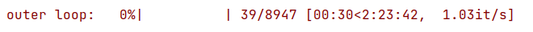
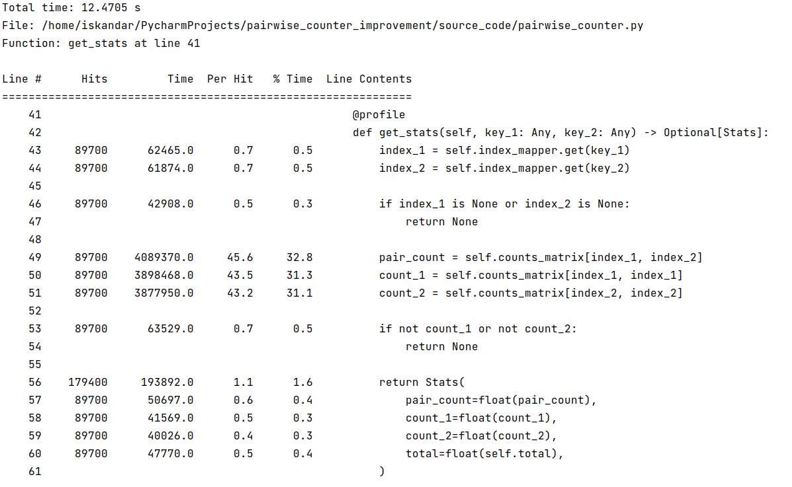
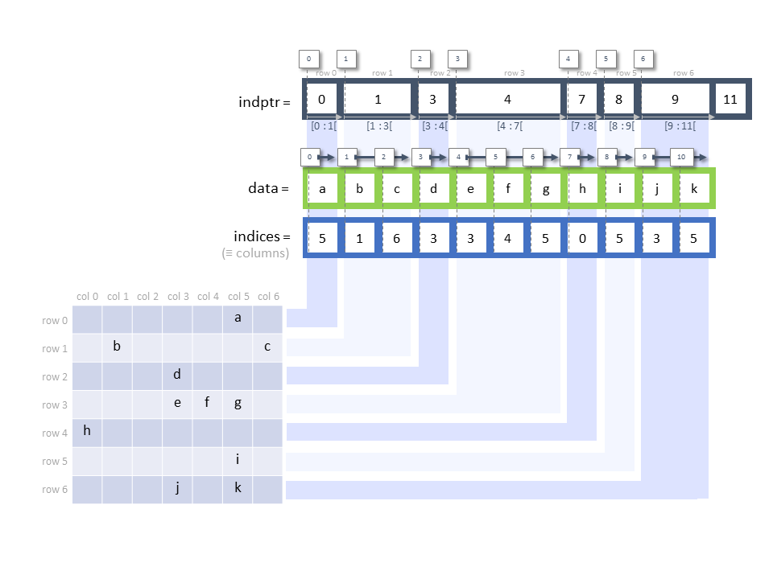
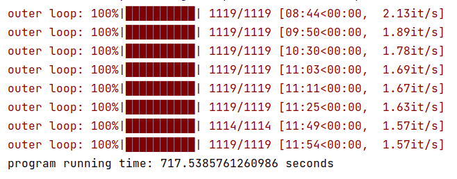

# Решение задания на курсе DS School Sber

## Что использовал:


## Краткое описание поставленной задачи

Вам дан реальный продакшн-код, в котором имеются серьёзные узкие места 
по времени работы. Ваша задача: разобраться, как он устроен,
как можно точнее найти узкие места при помощи профилировщика
и устранить их, сохраняя интерфейс 
(т.е. нельзя менять методы класса PairwiseCounter или его
сигнатуры).

## Предподсчёт кандидатов для ранжирования
Класс PairwiseCounter нужен для того, чтобы предпосчитать кандидатов для ранжирования в рекомендательной системе. А именно: для каждого товара он находит N наиболее часто встречающихся вместе с ним в одной корзине (здесь N = 10).

Тривиальная реализация этого функционала подразумевает два вложенных цикла. Это, очевидно, небыстро: сейчас подсчёт занимает примерно 2 часа. Ваша задача: добиться максимального прироста производительности, изменяя только реализацию методов класса PairwiseCounter и функцию, которая вычисляет списки кандидатов (её можно менять как угодно, лишь бы ответы совпадали).

Методы PairwiseCounter нельзя менять по той причине, что он используется не только здесь, но и при вычислении признакового описания продуктовых корзин. Поэтому придётся работать с тем, что есть.

В практике Яндекс.Лавки ускорение одного лишь класса PairwiseCounter значимо понизило долю таймаутов рекомендательной системы на треть, что дало дополнительные сотни тысяч рублей прибыли ежемесячно.

## Входные данные

В папке data находится файл, на основе которого нужно производить подсчет.

## Время работы до исправлений


## Поиск узких мест
Будем профилировать код с помощью ***line_profiler***

Для установки: 

```pip install line_profiler```

Чтобы найти проблемные места в коде нужно навесить декораторы *@profile* на методы, работу которых хотим замерить. 

Для запуска проверки:
```kernprof -lv main.py```

В консоль была выведена построчная информация для каждого метода, на который мы навесили декоратор. Подробно изучив вывод профайлера, я нашел проблемное место в коде.

Вот вывод профилировщика для этого метода:


Больше всего времени уходит на обращение к sparse.csr_matrix.

Пришлось разобраться в устройстве разреженной матрицы. 

Хорошая иллюстрация для этого:



## Что сделал
- Написал свой метод для обращения к csr_matrix. 
- Навесил на некоторые методы класса декораторы numba для ускорения. 
  
  ```@numba.jit(nopython=True)```
  
- Распараллелил код с помощью joblib, что сразу позволяет ускорить работу программы в ~N раз, где N = количеcтво потоков

## Насколько удалось ускорить

